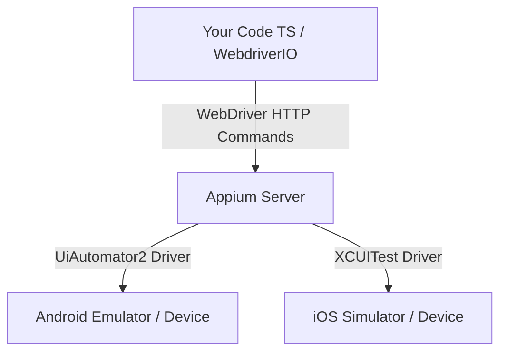

# 📱 Study Guide: Introduction to Mobile Automation (Appium & WebdriverIO)

This guide covers the fundamental concepts of architecture, tools, and execution lifecycles required to build automated tests for mobile applications (Android and iOS).

---

## 1. Web Emulation vs. Native Mobile Testing

Before writing automation scripts, it is crucial to understand the execution scope:

- **Mobile Web Emulation:** Simply resizes a desktop browser (like Playwright does by modifying the viewport of Chromium). While excellent for validating responsive layouts, **it does not interact with the mobile operating system**.
- **Native Mobile Testing:** Interacts with the actual compiled application package installed on the device (`.apk` for Android, `.app`/`.ipa` for iOS). This validates real mobile gestures (swipes, pinches), system permissions (camera, location, biometrics), push notifications, and device performance.

---

## 2. Appium Architecture (Client-Server Model)

Appium is an open-source HTTP server written in Node.js that exposes a REST API compliant with the W3C **WebDriver** protocol.



### Execution Lifecycle:
1. **The Client (Your Test):** Sends an HTTP REST request (e.g., *"Click on button X"*) to the Appium server.
2. **The Server (Appium Server):** Receives the command, translates it into the mobile OS native testing language, and sends it to the device.
3. **The Target Device (Emulator/Simulator):** Executes the action natively and returns the result (success/failure) back to the Appium server, which forwards it to your TypeScript runtime.

---

## 3. Why is Java Required if We Write Tests in TypeScript?

This is a common architectural question for engineers transitioning to SDET roles:

- **The Test Code:** Written 100% in **TypeScript** using WebdriverIO client libraries.
- **The Infrastructure (Android SDK):** The toolchain that interacts with the Android OS (developed by Google) relies on the **Java Development Kit (JDK)**.
- **UIAutomator2 Driver:** To control elements on the screen, Appium compiles and injects small background test helper packages (APKs) into the emulator. Compiling, signing, and deploying these assets requires a local Java installation.

Thus, Java is a **system dependency of the Android SDK and Appium**, not a programming requirement of your test script.

---

## 4. WebdriverIO (WDIO) Role

WebdriverIO acts as the **Client** in the Appium architecture. It provides:
- The test runner and execution structure (Mocha/Jasmine).
- A clean, modern JavaScript/TypeScript syntax to interact with Appium elements (e.g., `await $('~element-selector').click()`).
- Auto-management of mobile session lifecycles.

---

## 5. Desired Capabilities

Capabilities are key-value configurations sent in the HTTP request payload to tell the Appium server exactly what device, platform version, and application to automate.

Example configuration in `wdio.conf.ts`:

```typescript
capabilities: [{
  platformName: 'Android',          // Target OS
  'appium:deviceName': 'Pixel_7',   // Simulator Name
  'appium:automationName': 'UiAutomator2', // Native automation driver
  'appium:app': './apps/demo.apk',  // Path to target app package
  'appium:autoGrantPermissions': true // Grants camera/location permissions automatically
}]
```

---

## 6. Local Environment Setup Reference (Runbook)

Follow these terminal commands to configure the local mobile test environment on macOS:

### A. Java & Node Verification
```bash
# Verify Java Development Kit (JDK 17+)
java -version

# Verify Node.js and npm versions
node -v && npm -v
```

### B. Android Platform Tools & adb
```bash
# Install Android Debug Bridge (adb) via Homebrew
brew install --cask android-platform-tools

# Confirm adb works and is in PATH
adb version
```

### C. Android SDK & Emulation CLI Setup
```bash
# Install the custom Android CLI utility (Mac ARM64)
curl -fsSL https://dl.google.com/android/cli/latest/darwin_arm64/install.sh | bash

# Reload terminal shell environment profile
source ~/.zshrc

# Initialize the CLI and verify the installation
android init
android --version
```

### D. Download Mandatory Android SDK Packages
```bash
# Install Android Platform 34, Build Tools, and ARM64 System Image (Emulator OS)
android sdk install platforms/android-34 build-tools/34.0.0 system-images/android-34/google_apis/arm64-v8a
```
