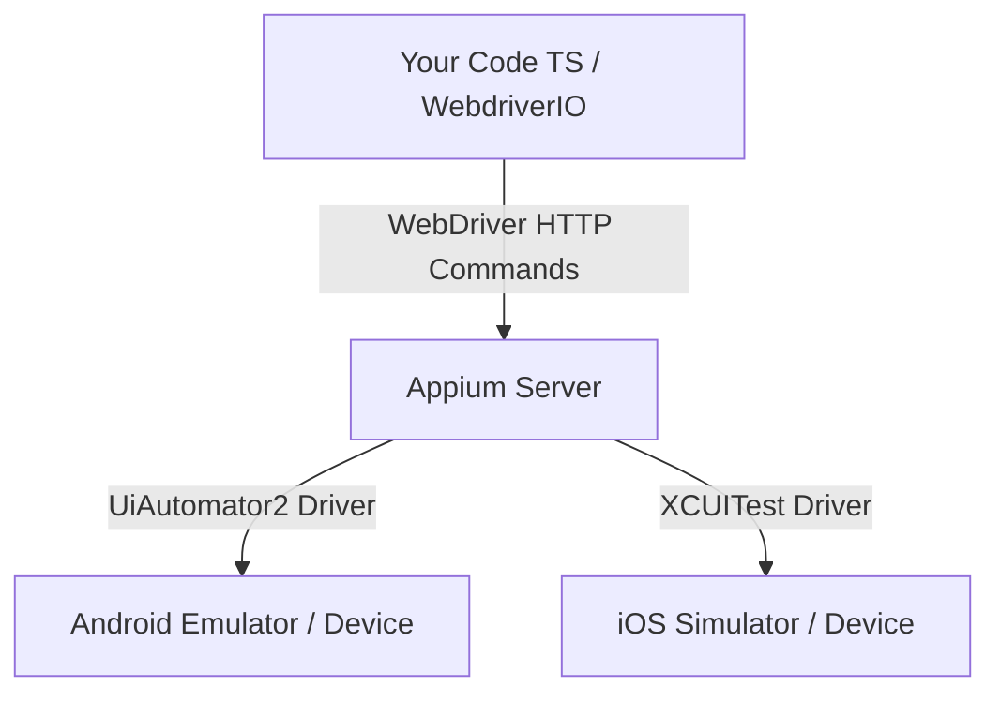

# 📱 Study Guide: Introduction to Mobile Automation (Appium & WebdriverIO)

This guide covers the fundamental concepts of architecture, tools, and execution lifecycles required to build automated tests for mobile applications (Android and iOS).

---

## 1. Web Emulation vs. Native Mobile Testing

Before writing automation scripts, it is crucial to understand the execution scope:

- **Mobile Web Emulation:** Simply resizes a desktop browser (like Playwright does by modifying the viewport of Chromium). While excellent for validating responsive layouts, **it does not interact with the mobile operating system**.
- **Native Mobile Testing:** Interacts with the actual compiled application package installed on the device (`.apk` for Android, `.app`/`.ipa` for iOS). This validates real mobile gestures (swipes, pinches), system permissions (camera, location, biometrics), push notifications, and device performance.

---

## 2. Appium Architecture (Client-Server Model)

Appium is an open-source HTTP server written in Node.js that exposes a REST API compliant with the W3C **WebDriver** protocol.



### Execution Lifecycle:

1. **The Client (Your Test):** Sends an HTTP REST request (e.g., _"Click on button X"_) to the Appium server.
2. **The Server (Appium Server):** Receives the command, translates it into the mobile OS native testing language, and sends it to the device.
3. **The Target Device (Emulator/Simulator):** Executes the action natively and returns the result (success/failure) back to the Appium server, which forwards it to your TypeScript runtime.

---

## 3. Why is Java Required if We Write Tests in TypeScript?

This is a common architectural question for engineers transitioning to SDET roles:

- **The Test Code:** Written 100% in **TypeScript** using WebdriverIO client libraries.
- **The Infrastructure (Android SDK):** The toolchain that interacts with the Android OS (developed by Google) relies on the **Java Development Kit (JDK)**.
- **UIAutomator2 Driver:** To control elements on the screen, Appium compiles and injects small background test helper packages (APKs) into the emulator. Compiling, signing, and deploying these assets requires a local Java installation.

Thus, Java is a **system dependency of the Android SDK and Appium**, not a programming requirement of your test script.

---

## 4. WebdriverIO (WDIO) Role

WebdriverIO acts as the **Client** in the Appium architecture. It provides:

- The test runner and execution structure (Mocha/Jasmine).
- A clean, modern JavaScript/TypeScript syntax to interact with Appium elements (e.g., `await $('~element-selector').click()`).
- Auto-management of mobile session lifecycles.

---

## 5. Desired Capabilities

Capabilities are key-value configurations sent in the HTTP request payload to tell the Appium server exactly what device, platform version, and application to automate.

Example configuration in `wdio.conf.ts`:

```typescript
capabilities: [
  {
    platformName: "Android", // Target OS
    "appium:deviceName": "Pixel_7", // Simulator Name
    "appium:automationName": "UiAutomator2", // Native automation driver
    "appium:app": "./apps/demo.apk", // Path to target app package
    "appium:autoGrantPermissions": true, // Grants camera/location permissions automatically
  },
];
```

---

## 6. Local Environment Setup Reference (Runbook)

Follow these terminal commands to configure the local mobile test environment on macOS:

### A. Java & Node Verification

```bash
# Verify Java Development Kit (JDK 17+)
java -version

# Verify Node.js and npm versions
node -v && npm -v
```

### B. Android Platform Tools & adb

```bash
# Install Android Debug Bridge (adb) via Homebrew
brew install --cask android-platform-tools

# Confirm adb works and is in PATH
adb version
```

### C. Android SDK & Emulation CLI Setup

```bash
# Install the custom Android CLI utility (Mac ARM64)
curl -fsSL https://dl.google.com/android/cli/latest/darwin_arm64/install.sh | bash

# Reload terminal shell environment profile
source ~/.zshrc

# Initialize the CLI and verify the installation
android init
android --version
```

### D. Download Mandatory Android SDK Packages

```bash
# Install Android Platform 34, Build Tools, and ARM64 System Image (Emulator OS)
android sdk install platforms/android-34 build-tools/34.0.0 system-images/android-34/google_apis/arm64-v8a
```

---

## 7. Mobile Locators Hierarchy (Best Practices)

Unlike web applications that query HTML DOM elements, native mobile testing queries the OS native accessibility and component hierarchy tree. Selecting the correct locator strategy is critical for test speed and stability:

```
          ▲
         ╱ ╲       1. Accessibility ID (Top Priority - Cross Platform)
        ╱ 1 ╲      2. Native OS Selectors (UiAutomator2 / XCUITest)
       ╱───2──╲    3. Resource ID / Class Name (Use with caution)
      ╱────3───╲   4. XPath (Anti-pattern - Avoid!)
     ╱─────4────╲
```

1. **Accessibility ID (`~selector`):**
   - _Android:_ Maps to `content-description`.
   - _iOS:_ Maps to `accessibilityIdentifier`.
   - _Best Practice:_ Pure cross-platform selector. Uses identical identifiers on both platforms and remains unaffected by visual layout changes.
2. **Native OS Selectors (`android=...` / `ios=...`):**
   - Communicates directly with the platform test engine (`UiSelector` in Android, Class Chain/Predicate in iOS). Essential for interacting with native OS alerts and system dialogs without Accessibility IDs.
3. **Class Name / Resource ID:**
   - Targets the widget class (`android.widget.EditText`). Prone to index mismatches when multiple widgets share the same class.
4. **XPath (Mobile Anti-Pattern):**
   - **Performance Penalty:** Requires Appium to recursively parse and serialize the entire native XML view hierarchy. A single XPath query can take 1 to 3 seconds per element.
   - **Flakiness:** Highly fragile to slight structural changes in the view hierarchy.

---

## 8. Mobile Page Object Model (Screen Objects Pattern)

In mobile testing, Page Objects are modeled around **Screens** and **Global Navigation Bars / Modals**:

### Key Implementation Rules:

- **Screen Naming Convention:** Name classes after screens (e.g., `LoginScreen`, `SwipeScreen`, `DialogScreen`) rather than web pages.
- **Dynamic Getters:** Define element locators as getters (`get inputEmail() { return $('~input-email'); }`). In WebdriverIO, getters return a `ChainablePromiseElement` evaluated dynamically upon access.
- **Base Screen Helper (`screen.ts`):** Inherits common polling and synchronization methods (e.g., `waitForElement`) strictly typed to accept `ChainablePromiseElement`.
- **System Dialog Decoupling:** Decouple native system pop-ups and OS dialogs into separate Screen Objects (`dialog.screen.ts`) to promote single-responsibility and cross-test reuse.

---

## 9. Resilient Emulator Lifecycle & Auto-Boot (`onPrepare`)

Enterprise mobile test suites must be autonomous and self-healing, eliminating manual prerequisites before test execution:

### Autonomous Boot in `wdio.conf.ts` (`onPrepare` hook):

1. **Dynamic Capabilities Inspection:** Reads target device (`appium:deviceName`) directly from the capabilities payload.
2. **Device Detection:** Queries `adb devices` to check if a live emulator/device is currently connected.
3. **Detached Process Spawning:** If no device is active, spawns `emulator -avd <name>` in background detached mode (`unref()`).
4. **Boot Polling:** Continuously polls `adb shell getprop sys.boot_completed` until the Android OS returns `1`, preventing session timeouts and startup race conditions.

### Graceful Shutdown:

- Use `adb emu kill` (or configured npm script `"emulator:stop"`) to send a safe shutdown signal to the emulator daemon without corrupting AVD disk snapshots.

---

## 10. Advanced Mobile Gestures (W3C Actions API)

### Why W3C Actions API Instead of `touchAction`?

In Appium 1.x, gestures were executed using `driver.touchAction()`. In modern **Appium 2.x**, `touchAction` is deprecated and removed in favor of the official **W3C WebDriver Actions Specification** (`browser.action('pointer')`).

- **Standardized**: Works across different drivers (UiAutomator2, XCUITest) using a unified protocol.
- **Physical Fidelity**: Accurately simulates hardware events (mouse, pen, touch) with acceleration, inertia, and deceleration.

### The Anatomy of a Touch Gesture

A native swipe gesture requires simulating a human finger touching a capacitive glass screen:

```
move (hover above start) ➔ down (finger contacts screen) ➔ pause (register touch/drag) ➔ move (drag across screen) ➔ up (lift finger) ➔ perform()
```

```typescript
await driver
  .action("pointer", {
    parameters: { pointerType: "touch" }, // Emulates capacitive touchscreen
  })
  .move({ x: startX, y: startY, duration: 0 })
  .down({ button: 0 }) // Primary finger contact
  .pause(100) // Essential: allows the OS to transition from "tap" to "drag" mode
  .move({ x: endX, y: endY, duration: 800 })
  .up({ button: 0 }) // Release finger
  .perform(); // Dispatch action sequence to Appium server
```

---

### Device-Agnostic Coordinate Math (Percentages vs Fixed Pixels)

**Never hardcode pixel values** (e.g., `x: 300, y: 800`). Pixel density and screen aspect ratios differ wildly across devices:

- A coordinate at `x: 300` might be center screen on a compact phone, but near the edge on a 12-inch tablet or foldable.

**SDET Solution**: Compute coordinates dynamically using viewport ratios via `driver.getWindowRect()`:

```typescript
const { width, height } = await driver.getWindowRect();

// Dynamic horizontal swipe (from right 85% to left 15% across center card height at 70%)
const startX = Math.round(width * 0.85);
const endX = Math.round(width * 0.15);
const posY = Math.round(height * 0.7);
```

---

### Native Android Selectors: UiAutomator2 & Accessibility IDs

1. **Accessibility ID (`$('~element')`)**:
   - Best practice for both Android (`content-desc`) and iOS (`accessibilityIdentifier`).
   - Resilient against layout changes and language internationalization.
2. **UiSelector (`$('android=new UiSelector().textContains(...)')`)**:
   - Directly triggers Android's native `UiAutomator2` Java API on the device.
   - Ideal when accessibility labels are missing or when asserting dynamic textual content.

---

### Key Interview Pitfalls & Traps

#### 1. The "Peeking Card" False Positive

- **Issue**: Modern mobile carousels intentionally display ~10-15% of the next card on the right screen boundary for UX discovery.
- **Trap**: Calling `isDisplayed()` on Card 2 before swiping can return `true` because its edge is technically rendered in the Android View hierarchy.
- **Solution**: Always assert against a card completely out of the viewport (e.g., Card 3), verifying absence (`toBe(false)`) prior to swiping, followed by presence (`toBe(true)`) after gesture execution.

#### 2. Sleep Anti-pattern vs Explicit Dynamic Waits

- **Never use `driver.pause(ms)` in CI/CD pipelines**: Hardcoded sleeps cause flakiness under varying server loads and inflate overall pipeline runtime.
- **Best Practice**: Use explicit element polling:

  ```typescript
  await element.waitForDisplayed({
    timeout: 5000,
    timeoutMsg: "Element was not displayed after gesture completion",
  });
  ```

  ***

## 11. Dynamic Viewport Discovery & Guardrailed Scrolling

### 11.1 The Mobile Viewport vs. Accessibility Tree Problem

In web automation, elements present in the DOM can often be located and scrolled into view automatically. In native mobile architectures (Android Views / Jetpack Compose & iOS UIKit / SwiftUI):

- Elements that are outside the visible physical viewport **do not exist** in the active Accessibility Tree (`Page Source`).
- Attempting to locate or call `waitForDisplayed()` on an off-screen element directly causes an immediate framework timeout and test failure.

### 11.2 The XPath Performance Penalty on Mobile

While XPath is an anti-pattern on the web due to fragility, on native mobile it carries a severe **performance penalty**:

- To evaluate an XPath query, the mobile driver (UiAutomator2 / XCUITest) must recursively serialize the entire native UI hierarchy into an in-memory XML document.
- A single XPath query can take 1 to 3 seconds per attempt, inflating memory usage and slowing down CI execution.
- **Best Practice:** When accessibility identifiers (`~locator`) are missing for dynamic text, avoid deep XPath trees. Prefer platform-native query drivers:
  - **Android:** `$('android=new UiSelector().text("You found me!!!")')`
  - **iOS:** `$('iOS class chain:...')` or `$('iOS predicate string:...')`

### 11.3 Guardrailed Dynamic Scrolling vs. Naive Loops

A common anti-pattern when scrolling for dynamic content is using unconstrained `while` loops or hardcoded pauses (`browser.pause(2000)`).

#### Production-Grade Implementation:

```typescript
async scrollToHiddenText(maxScrolls: number = 5): Promise<void> {
    let scrolls = 0;
    while (!(await this.hiddenText.isDisplayed()) && scrolls < maxScrolls) {
        await Gestures.swipeUp();
        scrolls++;
    }

    if (!(await this.hiddenText.isDisplayed())) {
        throw new Error(`Element was not found after ${maxScrolls} scroll attempts.`);
    }
}
```

### 11.4 Key Architectural Principles

1. **Defensive Guardrails (maxScrolls):** Prevents infinite loops and runner deadlocks on CI/CD pipelines if an element fails to render due to an application regression.
2. **Explicit Viewport Polling:** Evaluates `await element.isDisplayed()` cleanly after each discrete W3C pointer action sequence.
3. **Decoupled Responsibilities (Single Responsibility Principle):**
   - **Screen Object:** Encapsulates the guarded action loop (`scrollToHiddenText()`).
   - **Spec File (\*.spec.ts):** Handles formal test assertions (`toBeDisplayed()` and `toHaveText()`), ensuring explicit traceability in test reporting frameworks.

---

## 12. Nested Gesture Conflicts, Framework Concurrency & Log Sanitization

### 12.1 The Nested Gesture Conflict Problem

In cross-platform mobile architectures (e.g., React Native) and native apps, layouts frequently nest horizontal touch containers (such as a paginated Carousel / `HorizontalScrollView` / `FlatList`) inside an outer vertical `ScrollView`.

When automating touch gestures via the W3C Actions API:

- **Touch Event Interception:** If a vertical swipe (`pointerDown -> pointerMove -> pointerUp`) initiates inside the bounding box of a horizontal component with snapping behavior, the child component's gesture listener intercepts the touch event.
- **Inertia Reset (Snap-Back):** A vertical drag across a snapping horizontal carousel is interpreted as an invalid or canceled horizontal pan, causing the carousel to reset its scroll offset and snap back to Card 1.
- **Dynamic Shifting Viewports:** Static percentage coordinates (e.g., swiping from `y: 0.40` to `y: 0.10`) may work on the first gesture, but as the screen scrolls, components shift physically in the viewport. On subsequent iterations, those same static coordinates can land directly inside the child component.

### 12.2 State-Aware Coordinates & Gesture Momentum

To achieve deterministic vertical discovery across nested containers:

1. **State-Aware Safe Zones:**
   - **Pre-Scroll Phase:** The horizontal carousel occupies the lower viewport (`~50% - 88%`). Vertical gestures must be initiated in the upper safe zone (`y: 0.35` -> `y: 0.05`) to push the carousel upwards.
   - **Post-Scroll Phase:** The carousel shifts to the top (`~3% - 38%`). Subsequent swipes must be initiated in the lower safe zone (`y: 0.80` -> `y: 0.35`).

2. **Fling Momentum vs. Slow Drag:**
   - A gesture duration of `1000ms - 1200ms` with pauses is registered by the OS as a **slow drag** without velocity, moving content 1:1 and halting immediately upon finger release.
   - A duration of `300ms - 400ms` generates **fling momentum (inertia)**, allowing the native `ScrollView` to glide smoothly and reveal off-screen views with fewer overall actions.

```typescript
// Screen Object encapsulating state-aware W3C gestures
async scrollToHiddenText(maxScrolls: number = 5): Promise<void> {
  let scrolls = 0;
  while (!(await this.hiddenText.isDisplayed()) && scrolls < maxScrolls) {
    if (scrolls === 0) {
      // 1st scroll: Carousel is in lower viewport; swipe in upper safe zone
      await Gestures.swipe({ x: 0.5, y: 0.35 }, { x: 0.5, y: 0.05 }, 400);
    } else {
      // Subsequent scrolls: Carousel moved to top; swipe in lower safe zone
      await Gestures.swipe({ x: 0.5, y: 0.8 }, { x: 0.5, y: 0.35 }, 400);
    }
    scrolls++;
  }

  if (!(await this.hiddenText.isDisplayed())) {
    throw new Error(`Element was not found after ${maxScrolls} scroll attempts.`);
  }
}
```

### 12.3 Concurrency & Runner Isolation on Mobile (`maxInstances`)

Unlike modern web test runners (Playwright) which can spin up multiple isolated browser contexts concurrently on a single CPU, mobile execution on local emulators is strictly constrained:

- **Single Device / Single Port:** A local Android emulator (`emulator-5554`) or connected device can only bind to one active UiAutomator2 driver session at a time on port `4723`.
- **Race Condition:** Setting `maxInstances > 1` when executing multiple spec files causes WebdriverIO to fork multiple worker processes that concurrently issue commands to the same device, immediately resulting in `invalid session id` and socket closures (`UND_ERR_CLOSED`).
- **Rule:** For local single-device execution, configure `maxInstances: 1` in `wdio.conf.ts`. Only scale `maxInstances` when running against cloud device farms (BrowserStack, SauceLabs, AWS Device Farm) where each worker maps to a distinct physical device UUID.

### 12.4 Test Observability & Log Sanitization

By default, WebdriverIO with `logLevel: "info"` logs every raw JSON-RPC command (`POST /element`, polling retries, coordinates), creating overwhelming noise in terminal output.

To achieve clean, production-grade test reporting:

- Set `logLevel: "warn"` in `wdio.conf.ts` to surface only runner lifecycle events, warnings, and failure stack traces.
- Redirect low-level Appium server diagnostics to a persistent log file (`appium.log`) via `@wdio/appium-service` arguments:

```typescript
services: [
  [
    "appium",
    {
      args: {
        relaxedSecurity: true,
        log: "./appium.log",
      },
      logPath: "./logs",
    },
  ],
],
```

## 13. Native Element Inspection (The Mobile "DevTools")

Unlike web applications where developers press `F12` to open Chrome DevTools and inspect HTML/CSS DOM trees, native mobile applications do not render HTML. Mobile automation drivers interact directly with the **Native OS Accessibility Hierarchy** (Android Accessibility Node Info / iOS Accessibility Elements).

To inspect elements, retrieve selectors, and test locators in real-time, SDETs utilize dedicated mobile inspection tools.

### 13.1 Appium Inspector (The Standard Industry GUI)

[Appium Inspector](https://github.com/appium/appium-inspector) is the official, universal visual inspection tool for Appium. It is available as a cross-platform desktop application (macOS/Windows/Linux) or as a browser-based client at [inspector.appiumpro.com](https://inspector.appiumpro.com/).

#### Step-by-Step Workflow:

1. **Start Local Appium Server:** Ensure your Appium server is running in a terminal:
   ```bash
   appium --port 4723
   ```
2. **Configure Connection:**
   - **Remote Host:** `127.0.0.1` (or `localhost`)
   - **Remote Port:** `4723`
   - **Remote Path:** `/`
3. **Configure Desired Capabilities (JSON Representation):**
   ```json
   {
     "platformName": "Android",
     "appium:automationName": "UiAutomator2",
     "appium:deviceName": "medium_phone",
     "appium:app": "/absolute/path/to/app.apk",
     "appium:appWaitActivity": "com.wdiodemoapp.MainActivity"
   }
   ```
4. **Start Session & Inspect:**
   - Click **Start Session**. Appium boots the app on the emulator and mirrors the screen in real-time.
   - **Point-and-Click Inspection:** Click on any visual component (button, text field, card) to view its complete accessibility profile:
     - `accessibility id` (Highest priority: `~locator`)
     - `resource-id` (Platform ID: `com.app:id/button`)
     - `class` (Native widget: `android.widget.TextView`, `android.view.ViewGroup`)
     - `text` / `content-desc`
   - **Live Selector Search:** Use the search icon (magnifying glass) inside Appium Inspector to test WebdriverIO selectors (`~Login`, `new UiSelector().text("...")`) in real-time before committing them to code.

### 13.2 Android SDK Native Tool (`uiautomatorviewer`)

Shipped natively within the Android SDK, `uiautomatorviewer` is a lightweight alternative that takes static XML snapshots of any connected Android device without requiring an active Appium session:

```bash
# Launch from Android SDK command-line tools
$ANDROID_HOME/cmdline-tools/latest/bin/uiautomatorviewer
```

- Click the **Device Screenshot** button in the top-left toolbar.
- Hover over elements to inspect raw node attributes (`bounds`, `package`, `class`, `clickable`, `scrollable`).

### 13.3 Headless CLI Inspection (`adb uiautomator dump`)

In headless CI environments or rapid terminal debugging sessions where a GUI cannot be opened:

```bash
# 1. Dump active UI hierarchy to Android internal storage
adb shell uiautomator dump /sdcard/window_dump.xml

# 2. Stream XML directly to stdout for terminal inspection or grepping
adb exec-out cat /sdcard/window_dump.xml
```

---

## 14. Bootstrapping a Production Framework from Scratch (The 15-Minute Blueprint)

A common misconception among test automation engineers is that building a mobile framework from scratch requires days of boilerplate generation. In modern WebdriverIO v9 + Appium 2.x, a production-grade, typed mobile framework consists of **5 deterministic, repeatable steps**:

### Step 1: Initialize Workspace & Install Core Dependencies

In a fresh directory, initialize `package.json` and install the modular WebdriverIO and Appium ecosystem:

```bash
mkdir my-mobile-framework && cd my-mobile-framework
npm init -y

# Core runner, services, TypeScript engine, and assertion library
npm install --save-dev \
  @wdio/cli \
  @wdio/local-runner \
  @wdio/mocha-framework \
  @wdio/spec-reporter \
  @wdio/appium-service \
  appium \
  appium-uiautomator2-driver \
  @wdio/globals \
  @types/node \
  typescript \
  ts-node \
  expect-webdriverio
```

#### Why Each Package Exists:

- `@wdio/cli`: Command-line test orchestrator (`npx wdio run`).
- `@wdio/local-runner`: Process spawner for parallel worker processes.
- `@wdio/mocha-framework`: BDD syntax adapter (`describe`, `it`, `before`).
- `@wdio/spec-reporter`: Clean, hierarchical terminal test reporter.
- `@wdio/appium-service`: Lifecycle manager that automatically spawns and terminates Appium processes in background.
- `appium` & `appium-uiautomator2-driver`: Local driver binaries executed by the Appium service.
- `@wdio/globals`: Strongly-typed global utilities (`$`, `$$`, `driver`, `expect`).
- `expect-webdriverio`: Smart async matcher assertions with built-in retry polling.

### Step 2: Minimalist `tsconfig.json`

Create `tsconfig.json` in the root directory:

```json
{
  "compilerOptions": {
    "module": "commonjs",
    "target": "es2022",
    "lib": ["es2022", "dom"],
    "types": [
      "node",
      "@wdio/globals/types",
      "@wdio/mocha-framework",
      "expect-webdriverio"
    ],
    "skipLibCheck": true,
    "strict": true
  },
  "include": ["./**/*.ts"]
}
```

### Step 3: Lean Production Configuration (`wdio.conf.ts`)

Create `wdio.conf.ts` (stripped of bloated default comments):

```typescript
export const config: WebdriverIO.Config = {
  runner: "local",
  specs: ["./test/specs/**/*.spec.ts"],
  maxInstances: 1, // Single emulator = 1 worker to prevent session collision
  capabilities: [
    {
      platformName: "Android",
      "appium:deviceName": "medium_phone",
      "appium:automationName": "UiAutomator2",
      "appium:app": "./apps/android.app.apk",
      "appium:appWaitActivity": "com.wdiodemoapp.MainActivity",
      "appium:newCommandTimeout": 240,
    },
  ],
  logLevel: "warn", // Suppress raw JSON-RPC HTTP wire logs
  services: [
    [
      "appium",
      {
        args: {
          relaxedSecurity: true,
        },
      },
    ],
  ],
  framework: "mocha",
  reporters: ["spec"],
  mochaOpts: {
    ui: "bdd",
    timeout: 60000,
  },
};
```

### Step 4: Screen Object Model (`test/pageobjects/login.screen.ts`)

Encapsulate accessibility selectors and user actions:

```typescript
import { $ } from "@wdio/globals";

class LoginScreen {
  // Accessibility locators (~ prefix)
  get loginTab() {
    return $("~Login");
  }
  get emailInput() {
    return $("~input-email");
  }
  get passwordInput() {
    return $("~input-password");
  }
  get loginButton() {
    return $("~button-LOGIN");
  }
  get successAlert() {
    return $('android=new UiSelector().text("Success")');
  }

  async navigateToLogin(): Promise<void> {
    await this.loginTab.click();
    await this.loginButton.waitForDisplayed({ timeout: 5000 });
  }

  async login(email: string, pass: string): Promise<void> {
    await this.emailInput.setValue(email);
    await this.passwordInput.setValue(pass);
    await this.loginButton.click();
  }
}

export default new LoginScreen();
```

### Step 5: Test Execution & Assertion (`test/specs/login.spec.ts`)

```typescript
import { expect } from "@wdio/globals";
import LoginScreen from "../pageobjects/login.screen";

describe("Mobile Automation From Scratch", () => {
  it("should navigate and authenticate successfully", async () => {
    await LoginScreen.navigateToLogin();
    await LoginScreen.login("alice@example.com", "12345678");
    await expect(LoginScreen.successAlert).toBeDisplayed();
  });
});
```

Run test suite:

```bash
npx wdio run ./wdio.conf.ts
```

---

## 15. Mobile CI/CD: Headless Android Emulation on GitHub Actions

Running mobile tests in continuous integration pipelines requires infrastructure decisions fundamentally different from web automation. The primary bottleneck is the compute overhead required to boot and run an Android emulator with hardware acceleration.

### 15.1 The macOS Runner Fallacy (`macos-13` vs `ubuntu-latest`)

Historically, community tutorials recommended macOS runners (`macos-13`) for Android testing because Apple's `Hypervisor.framework` was enabled by default on Intel instances.

**Current Industry Landscape:**

1. **`macos-13` Deprecation:** GitHub has officially retired and decommissioned Intel `macos-13` runner images. Submitting a workflow targeting `macos-13` results in the job sitting in a perpetual `Queued` state for up to 24 hours before being terminated.
2. **`macos-latest` (Apple Silicon - ARM64):** Modern macOS runners operate on M-series chips. Nested virtualization for standard x86 Android emulators is unstable on these public runners, and macOS compute minutes cost up to 10x more than Linux minutes.
3. **`ubuntu-latest` with KVM (The Engineering Standard):** GitHub Actions Linux runners provide access to **KVM (Kernel-based Virtual Machine)**. With direct CPU hardware virtualization exposed, a headless Android emulator boots in 60 to 90 seconds with zero licensing overhead.

### 15.2 What is KVM?

> **KVM (Kernel-based Virtual Machine)** is a full virtualization module built directly into the Linux kernel. It turns the Linux kernel into a Type-1 hypervisor. This allows the host CPU to expose its hardware virtualization extensions (Intel VT-x or AMD-V) directly to the guest virtual machine (the Android emulator), eliminating the massive performance penalty of pure software emulation.

### 15.3 Deterministic GitHub Actions Configuration

To enable KVM and execute tests via WebdriverIO and Appium, the workflow must set up the `udev` rule for `/dev/kvm` prior to invoking the emulator runner action:

```yaml
jobs:
  android-e2e:
    name: 🤖 Android E2E Tests (Headless Emulator)
    runs-on: ubuntu-latest
    timeout-minutes: 25

    steps:
      - name: 📁 Checkout Repository
        uses: actions/checkout@v4

      - name: ⚡ Enable KVM Hardware Acceleration
        run: |
          echo 'KERNEL=="kvm", GROUP="kvm", MODE="0666", OPTIONS+="static_node=kvm"' | sudo tee /etc/udev/rules.d/99-kvm4all.rules
          sudo udevadm control --reload-rules
          sudo udevadm trigger --name-match=kvm

      - name: ☕ Setup Java 17
        uses: actions/setup-java@v4
        with:
          distribution: "temurin"
          java-version: "17"

      - name: 🟢 Setup Node.js 20
        uses: actions/setup-node@v4
        with:
          node-version: "20"
          cache: "npm"
          cache-dependency-path: sdet-mobile-appium/package-lock.json

      - name: 📦 Install Mobile Project Dependencies
        working-directory: sdet-mobile-appium
        run: npm ci

      - name: 🚀 Run Tests on Headless Android Emulator
        uses: reactivecircus/android-emulator-runner@v2
        with:
          api-level: 30
          target: default
          arch: x86_64
          profile: pixel_6
          emulator-options: -no-window -no-audio -no-boot-anim -gpu swiftshader_indirect
          working-directory: sdet-mobile-appium
          script: npm test

      - name: 📊 Upload Test Results
        if: always()
        uses: actions/upload-artifact@v4
        with:
          name: appium-reports
          path: sdet-mobile-appium/reports/
          retention-days: 7
```
